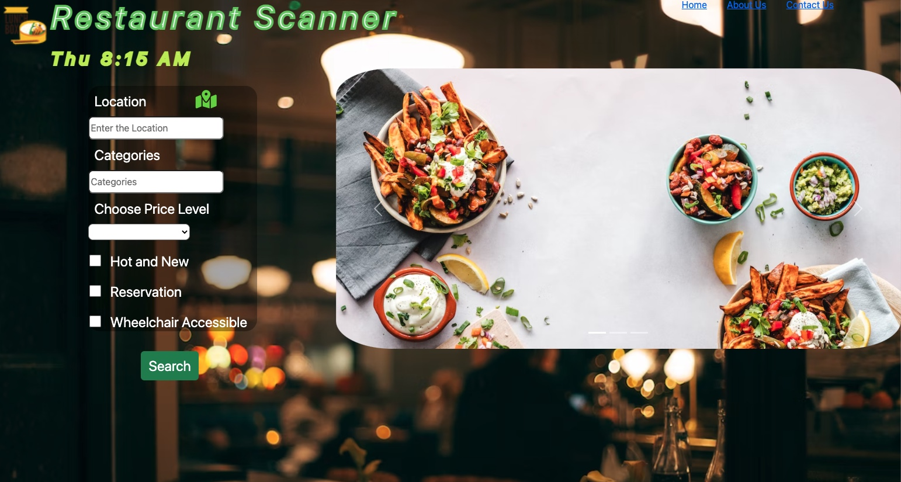

# _Restaurant Scanner_

By Miggie Garcia, Nabin Dhakal, Weijun Huang, and Kevin Kash.
A simple interface for finding restaurants and information about them.

## Technologies Used

- _HTML_
- _CSS_
- _JAVASCRIPT_
- _YELP API_
- _GEOLOCATION API_

## Description

_This application allows a user to find details about restaurants through the Yelp API. The user can enter location or other preferences for their search or use geolocation to find restaurants in their area._

## Setup/Installation Requirements

- _Clone this repository to your desktop_
- _Navigate to the top level of the directory_
- _Open index.html in your browser_

## Known Bugs

- _Requires Proxy Server in order to run_
